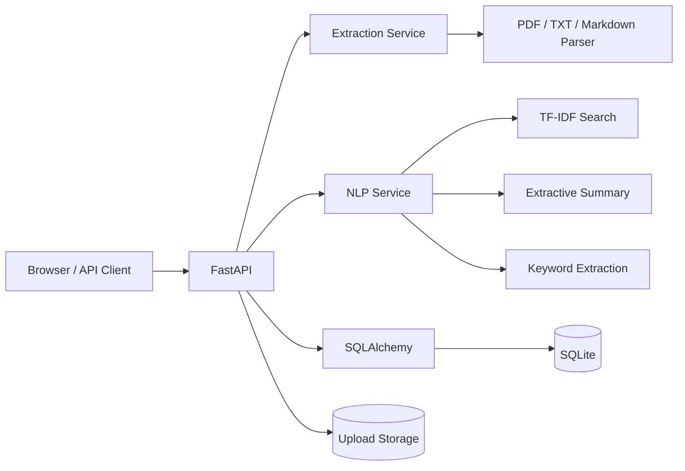

# Architecture

Document Intelligence Workbench is an end-to-end information retrieval system: ingest unstructured documents, persist normalized metadata and chunks, derive local NLP intelligence, and expose both a human UI and typed API.

FastAPI provides typed request/response models and automatic OpenAPI documentation. SQLAlchemy models documents and chunks relationally. Local deterministic NLP keeps the demo runnable without paid APIs, while the service boundary allows future replacement with embeddings, a vector database, or an LLM provider.
